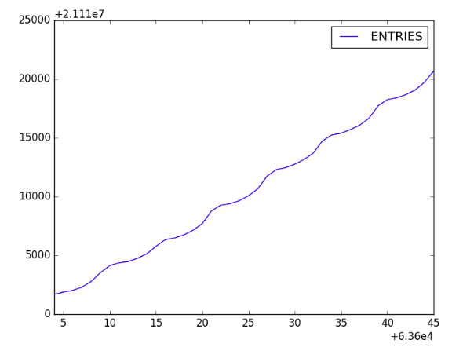
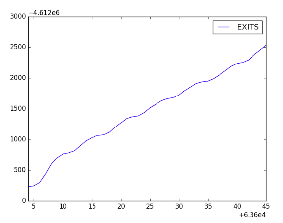
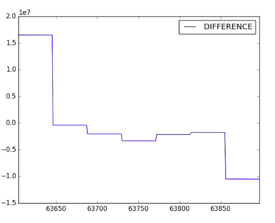

# Cypress Hills

## Demographics and Statistics
1. Population: 57,996
2. Female: 52%
3. Male: 48%
4. Hispanic: 60%
5. African American: 26%
6. Asian: 7%
7. White: 3%
8. Other race: 1%
9. Two or more races: 1%

10. In Cypress Hills (Broadway-Junction station), there are approximately 62,496 people who are affected by the loss of the L train (J, Z and L trains share this stop, the calculations did not account for this). The most practical temporary replacement of the L train are 3 bus lanes for the 4 morning hours. Cars and bikes are also other possible transportation options. The other subway lines, especially the J and the Z, should be able to accomodate for most trips to Manhattan.

## Station Usage Statistics

## geoJSON map

