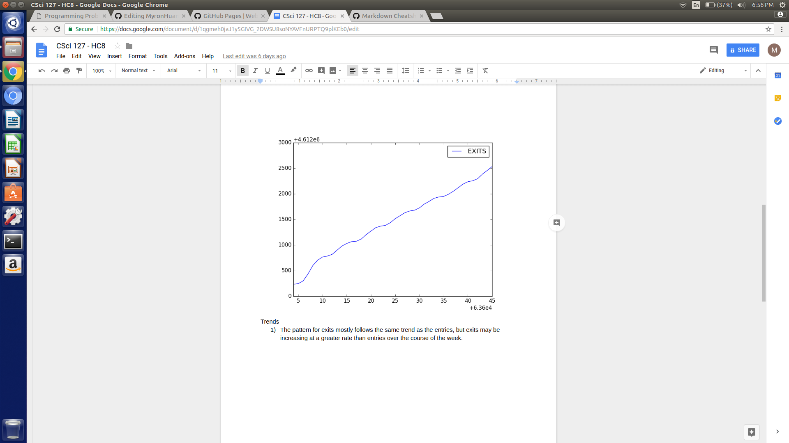
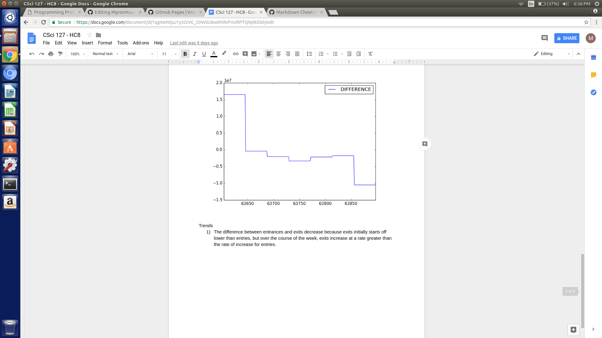
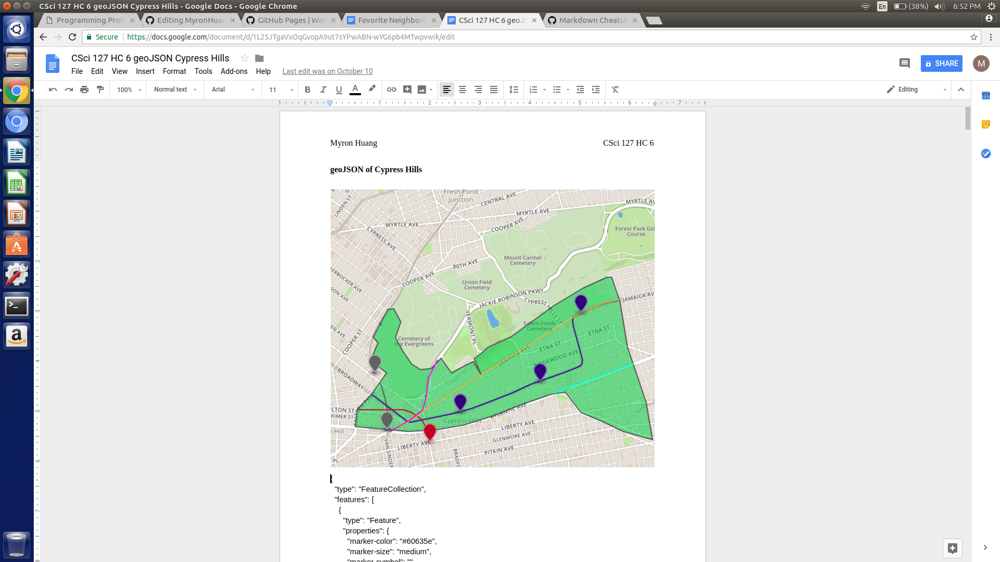

# Cypress Hills

## Demographics and Statistics
1. Population: 57,996
2. Female: 52%
3. Male: 48%
4. Hispanic: 60%
5. African American: 26%
6. Asian: 7%
7. White: 3%
8. Other race: 1%
9. Two or more races: 1%

## Station Usage Statistics

## geoJSON map

